# 📚 LIBMASTER – Ứng dụng Quản lý Thư viện

**LIBMASTER** là một ứng dụng quản lý thư viện thân thiện, dễ sử dụng, được xây dựng nhằm hỗ trợ quản trị viên trong việc vận hành hệ thống một cách hiệu quả, trực quan và nhanh chóng. Giao diện được thiết kế hiện đại, phản hồi nhanh, tích hợp chatbot AI.

---

## 👥 Tác giả

Dự án **LIBMASTER – Library Management System** được phát triển bởi nhóm Cựu Chiến Binh:

- **Nguyễn Hải An** – 23020581
- **Nguyễn Xuân Quang** – 20020463
- **Phạm Thành Luân** – 20020542

## 📊 Đăng nhập
- Giao diện đăng nhập đơn giản, dễ dùng, dễ tiếp cận.

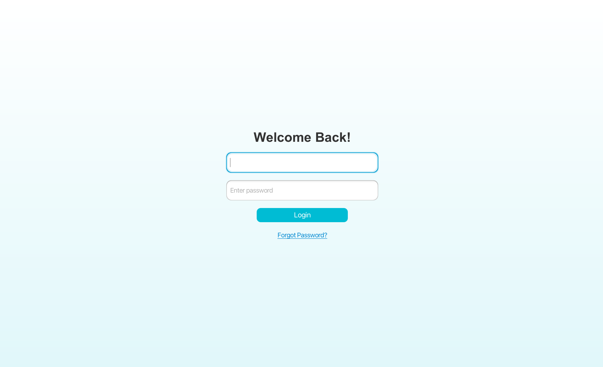

## 📊 Màn hình chính
- Màn hình chính của ứng dụng cung cấp cái nhìn tổng quan về các thông tin, thống kê của thư viện và bao gồm các phím tắt để thực hiện các thao tác một cách nhanh chóng.


## 🧩 Tính năng chính

### 📖 Quản lý Thư viện (Sách)
- **Giao diện thư viện**

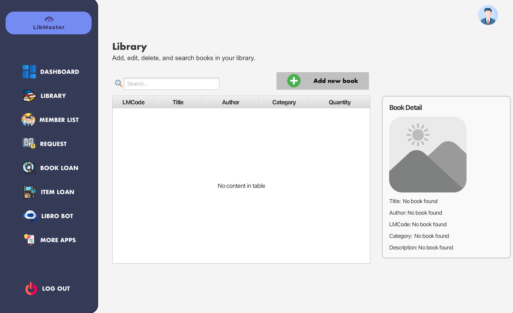

- **Thêm sách qua API**: Tìm kiếm và thêm thông tin sách từ Google Books API.

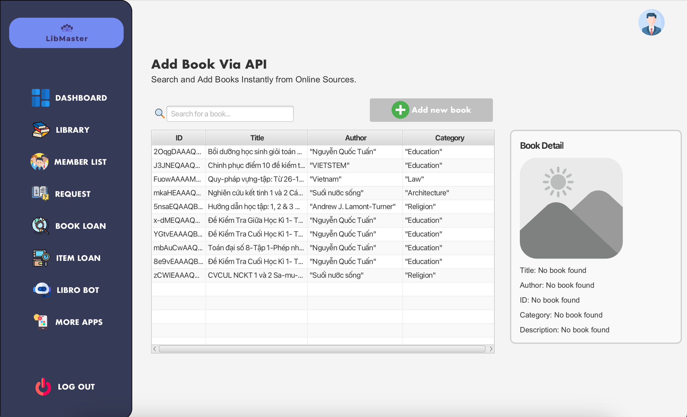

- **Thêm sách thủ công**: Cho phép thêm sách theo cách nhập tay.

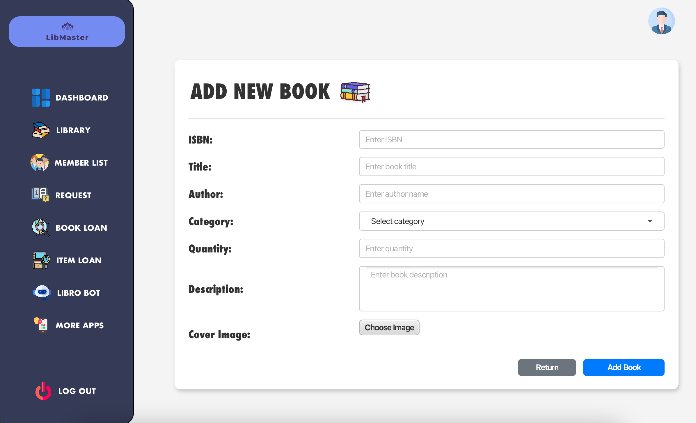

- **Chỉnh sửa sách**: Cập nhật thông tin sách hiện có.

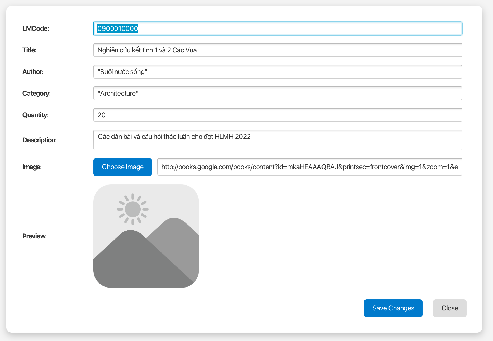

- **Xoá sách**: Xoá sách khỏi hệ thống (Có sẵn trên giao diện thư viện).

### 📕 Quản lý Mượn sách
- **Giao diện mượn sách**

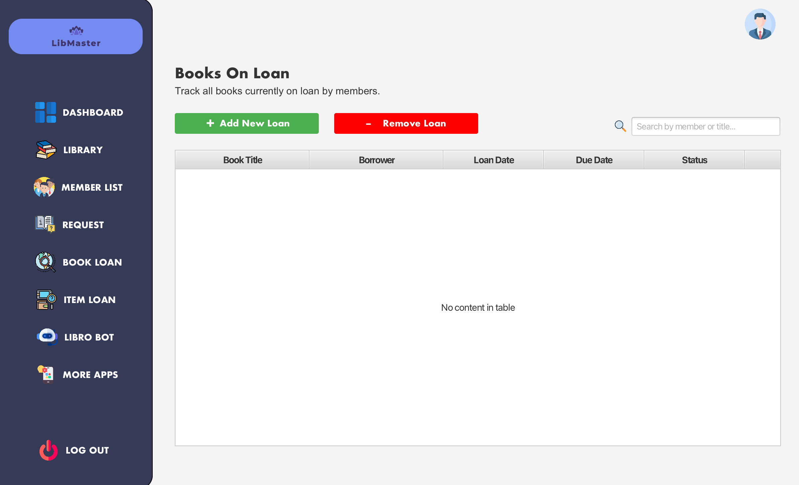

- **Tạo yêu cầu mượn sách**: Chọn sách, thành viên và thời gian mượn.

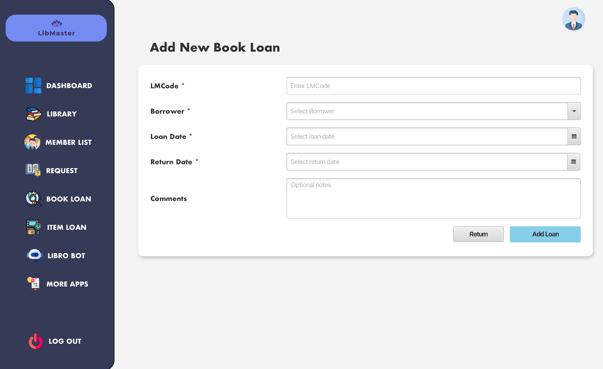

- **Xoá yêu cầu mượn sách**: Hỗ trợ huỷ các yêu cầu sai hoặc không còn hiệu lực (Có sẵn trên giao diện mượn sách).

### 🧑‍🤝‍🧑 Quản lý Thành viên
- **Giao diện quản lý thành viên**


- **Thêm thành viên**: Cung cấp form nhập thông tin thành viên (họ tên, số điện thoại, email, địa chỉ…).

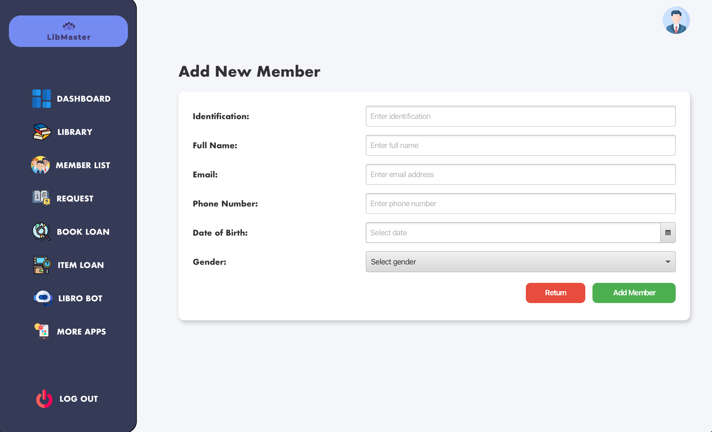

- **Chỉnh sửa thông tin thành viên**: Cập nhật thông tin thành viên hiện tại.

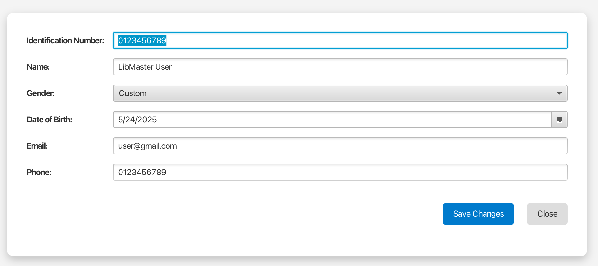

- **Xem thông tin thành viên**: Xem thông tin của thành viên được chọn.

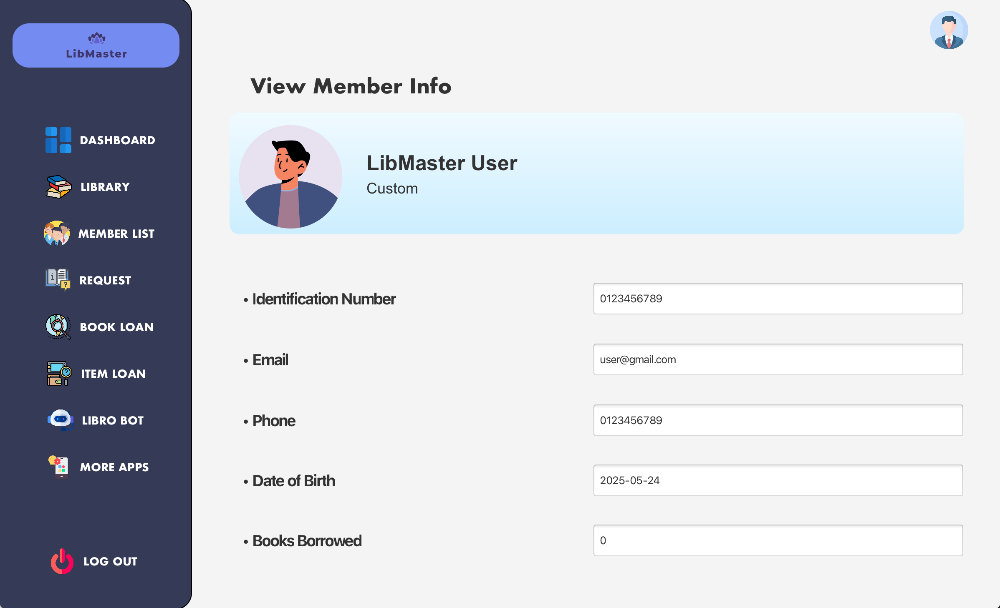

- **Xoá thành viên**: Xoá thông tin thành viên khỏi hệ thống khi không còn cần thiết (Có sẵn trên giao diện quản lý thành viên).

### 🌐 Quản lý Yêu cầu từ Web (đang phát triển cho người dùng online)
- **Giao diện quản lý yêu cầu từ Web App**

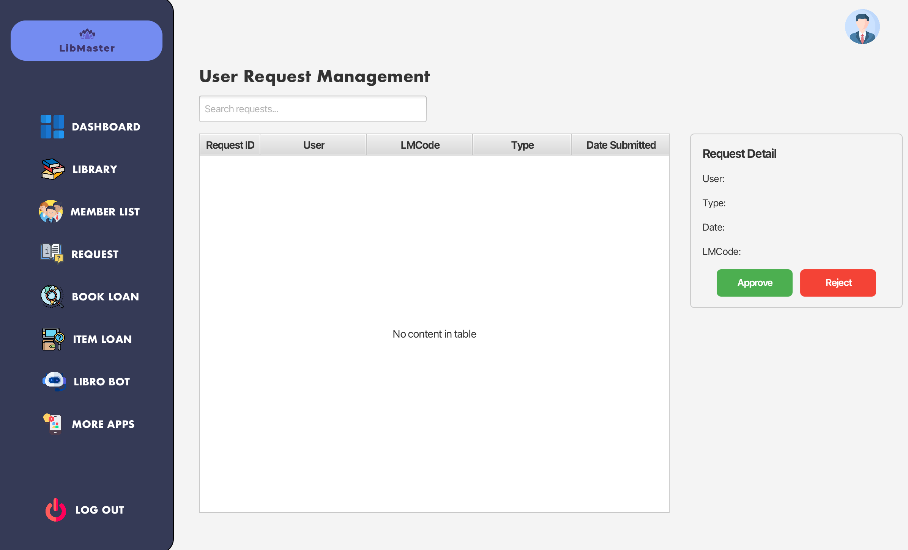

- **Chấp nhận/huỷ yêu cầu đăng ký dịch vụ thư viện** từ người dùng web (ví dụ: đăng ký tài khoản mượn sách trực tuyến).
- **Xử lý tự động và lưu trữ hồ sơ yêu cầu** (đang trong quá trình hoàn thiện).

### 📦 Mượn các loại Item khác ngoài sách
- **DVD** – *Giao diện quản lý DVD*

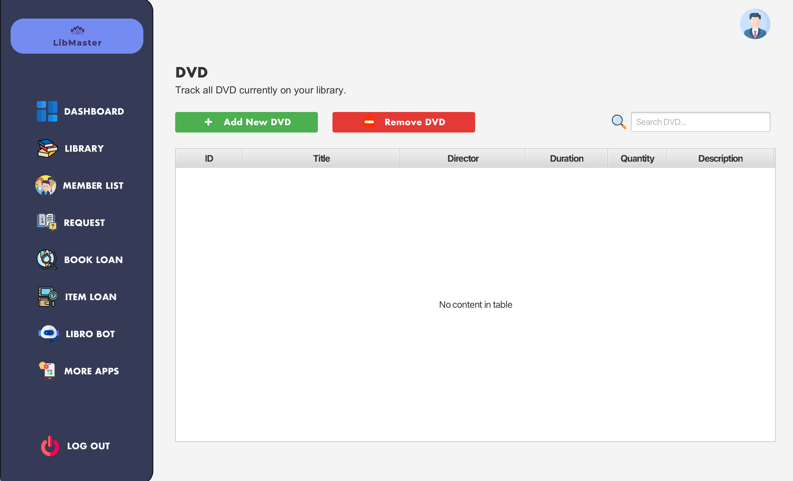

- **Đồ án** – *Giao diện quản lý đồ án*


- **Tạp chí** – *Giao diện quản lý tạp chí*

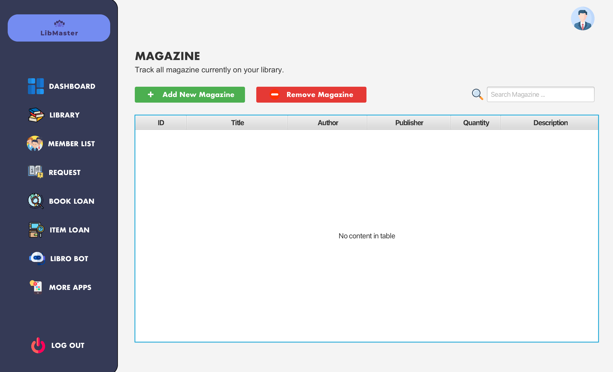

Mỗi loại item có **form riêng** để nhập thông tin và thống kê tổng số lượng đã mượn/trả theo từng loại.

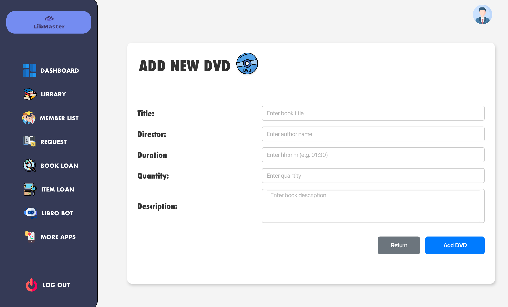

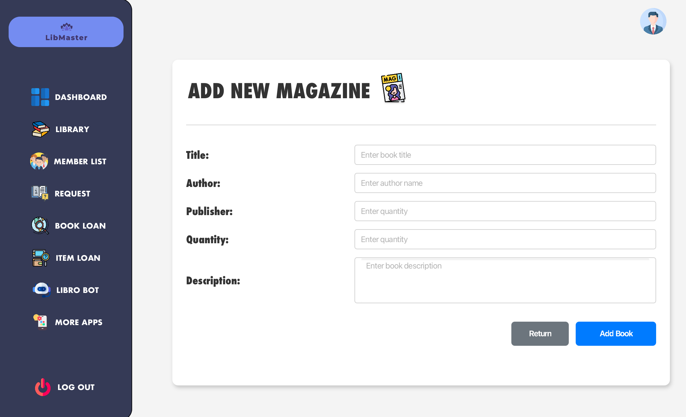

## 🤖 Chatbot AI: Libro

**Libro** là trợ lý AI tích hợp dành riêng cho quản trị viên thư viện.

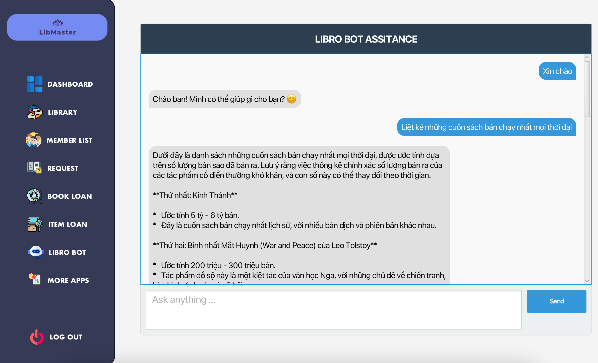

> **⚠️ Ghi chú quan trọng:**  
> Libro thực chất được xây dựng dựa trên mô hình **Gemma 3 của Ollama**.  
> Mọi bản quyền, công sức phát triển đều thuộc về nhóm tác giả của mô hình **Gemma 3**.  
> Mã nguồn lấy phản hồi từ bot được tham khảo và điều chỉnh từ kênh **Mintype**.

### 📌 Mục đích sử dụng

Libro hỗ trợ quản trị viên với các chức năng sau:
- 🧠 Trả lời câu hỏi liên quan đến nghiệp vụ thư viện (ví dụ: phân loại sách, quy trình xử lý mượn trả…)
- 📄 Viết thô tài liệu nội bộ (quy định, thông báo…)
- 🧾 Gợi ý soạn email nhắc nhở trả sách quá hạn hoặc thư cảm ơn
- 🛠️ Gợi ý truy vấn SQL đơn giản hoặc cách tổ chức database
- 💡 Gợi ý sự kiện thư viện (câu lạc bộ sách, triển lãm, workshop)
- 📊 Hỗ trợ tóm tắt báo cáo theo yêu cầu

> Tốc độ phản hồi trung bình do AI đang chạy trên môi trường **local**, phù hợp cho nhu cầu tư vấn cơ bản.

## 🎨 Giao diện
- Thân thiện, dễ sử dụng, tối ưu cho thao tác quản trị viên
- Tốc độ phản hồi giao diện nhanh
- Có hỗ trợ hiển thị bảng, thống kê, biểu mẫu

## 📂 Công nghệ sử dụng
- **Java**
- **MySQL**
- **FXML**
- **Google Books API**
- **Gemma 3 (Ollama)**
- **HTML, CSS, JavaScript**

## 📂 Mã Nguồn Tham Khảo

Dự án LIBMASTER có tham khảo, xin ý tưởng mã nguồn từ:

- Youtube Mintype: Mã nguồn lấy phản hồi từ AI Bot của Ollama
- Thạc Sĩ Nguyễn Hải Long UET
- ChatGPT
- V0.dev

---

## 🏷️ Hướng dẫn điền mã `LMcode`

`LMcode` (Library Master Code) là mã định danh duy nhất dành cho **mọi đầu sách, tạp chí, DVD, đồ án…** trong hệ thống LIBMASTER. Mỗi `LMcode` giúp quản trị viên quản lý item một cách hệ thống, phân loại rõ ràng theo thể loại và thứ tự nhập kho.

### 🔢 Cấu trúc mã `LMcode`

```
[TT][SSSSS][AA]
```

- `TT`: Mã thể loại gồm **2 chữ số** (theo bảng phân loại của LIBMASTER)
- `SSSSS`: Mã định danh của sách (gồm **5 chữ số**)
- `AA`: Số lượng của sách (gồm **2 chữ số**)


### 📂 Bảng mã thể loại (TT)

| TT | Genre                 |
|----|-----------------------|
| 10 | Literature            |
| 11 | Poetry                |
| 12 | Drama                 |
| 13 | Fiction               |
| 14 | Romance               |
| 15 | Thriller              |
| 16 | Science Fiction       |
| 17 | Fantasy               |
| 18 | Mystery               |
| 19 | Horror                |
| 20 | Science               |
| 21 | Mathematics           |
| 22 | Physics               |
| 23 | Chemistry             |
| 24 | Biology               |
| 25 | Computer Science      |
| 30 | History               |
| 31 | Geography             |
| 32 | Archaeology           |
| 40 | Children              |
| 41 | Young Adult           |
| 50 | Psychology            |
| 51 | Sociology             |
| 52 | Philosophy            |
| 60 | Religion              |
| 61 | Spirituality          |
| 70 | Language Learning     |
| 71 | English Language      |
| 72 | French Language       |
| 73 | Chinese Language      |
| 80 | Economics             |
| 81 | Business & Management |
| 82 | Marketing             |
| 90 | Art                   |
| 91 | Music                 |
| 92 | Photography           |
| 93 | Design                |
| 99 | Other                 |

### 📝 Cách điền `LMCode` khi thêm sách thủ công

1. **Xác định thể loại** của sách (theo bảng trên)
2. **Tra thứ tự hiện tại** trong bảng mã của thể loại đó
3. **Xem số lượng** của sách đó

**Ví dụ:** Bạn thêm 6 cuốn sách giống nhau và thuộc thể loại Fantasy (TT = 17)  
→ `LMCode = 171234506`

---

**© 2025 – LIBMASTER Library Management System**
